# Домашнее задание к занятию «Основы Git» - Михалёв Сергей

### Цель задания

В результате выполнения задания вы:

* научитесь работать с Git, как с распределённой системой контроля версий; 
* сможете создавать и настраивать репозиторий для работы в GitHub, GitLab и Bitbucket; 
* попрактикуетесь работать с тегами;
* поработаете с Git при помощи визуального редактора.

------

## Задание 1. Знакомимся с GitLab и Bitbucket 

### GitLab

Создадим аккаунт в GitLab, если у вас его ещё нет:

1. GitLab. Для [регистрации](https://gitlab.com/users/sign_up)  можно использовать аккаунт Google, GitHub и другие. 
1. После регистрации или авторизации в GitLab создайте новый проект, нажав на ссылку `Create a projet`. 
Желательно назвать также, как и в GitHub — `devops-netology` и `visibility level`, выбрать `Public`.
1. Галочку `Initialize repository with a README` лучше не ставить, чтобы не пришлось разрешать конфликты.
1. Если вы зарегистрировались при помощи аккаунта в другой системе и не указали пароль, то увидите сообщение:
`You won't be able to pull or push project code via HTTPS until you set a password on your account`. 
Тогда перейдите [по ссылке](https://gitlab.com/profile/password/edit) из этого сообщения и задайте пароль. 
Если вы уже умеете пользоваться SSH-ключами, то воспользуйтесь этой возможностью (подробнее про SSH мы поговорим в следующем учебном блоке).
1. Перейдите на страницу созданного вами репозитория, URL будет примерно такой:
https://gitlab.com/YOUR_LOGIN/devops-netology. Изучите предлагаемые варианты для начала работы в репозитории в секции
`Command line instructions`. 
1. Запомните вывод команды `git remote -v`.
1. Из-за того, что это будет наш дополнительный репозиторий, ни один вариант из перечисленных в инструкции (на странице 
вновь созданного репозитория) нам не подходит. Поэтому добавляем этот репозиторий, как дополнительный `remote`, к созданному
репозиторию в рамках предыдущего домашнего задания:
`git remote add gitlab https://gitlab.com/YOUR_LOGIN/devops-netology.git`.
1. Отправьте изменения в новый удалённый репозиторий `git push -u gitlab main`.
1. Обратите внимание, как изменился результат работы команды `git remote -v`.

**Решение**

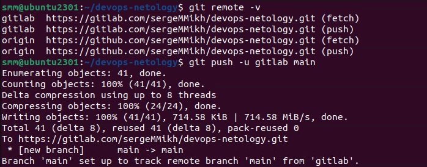

____

### Bitbucket

Теперь необходимо проделать всё то же самое с [Bitbucket](https://bitbucket.org/). 

1. Обратите внимание, что репозиторий должен быть публичным — отключите галочку `private repository` при создании репозитория.
1. На вопрос `Include a README?` отвечайте отказом. 
1. В отличии от GitHub и GitLab в Bitbucket репозиторий должен принадлежать проекту, поэтому во время создания репозитория 
надо создать и проект, который можно назвать, например, `netology`.
1. Аналогично GitLab на странице вновь созданного проекта выберите `https`, чтобы получить ссылку, и добавьте этот репозиторий, как 
`git remote add bitbucket ...`.
1. Обратите внимание, как изменился результат работы команды `git remote -v`.

Выполните push локальной ветки `main` в новые репозитории. 

**Решение**

  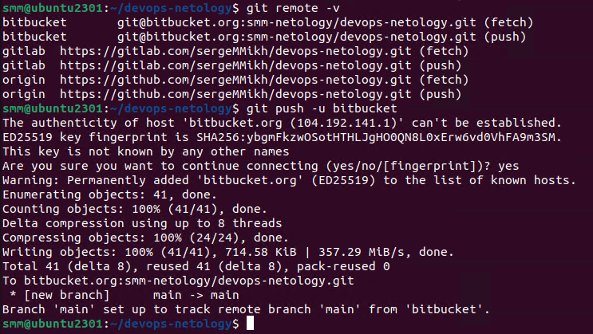

------

## Задание 2. Теги

Представьте ситуацию, когда в коде была обнаружена ошибка — надо вернуться на предыдущую версию кода,
исправить её и выложить исправленный код в продакшн. Мы никуда не будем выкладывать код, но пометим некоторые коммиты тегами и создадим от них ветки. 

1. Создайте легковестный тег `v0.0` на HEAD-коммите и запуште его во все три добавленных на предыдущем этапе `upstream`.
1. Аналогично создайте аннотированный тег `v0.1`.
1. Перейдите на страницу просмотра тегов в GitHab (и в других репозиториях) и посмотрите, чем отличаются созданные теги. 
    * в GitHub — https://github.com/YOUR_ACCOUNT/devops-netology/releases;
    * в GitLab — https://gitlab.com/YOUR_ACCOUNT/devops-netology/-/tags;
    * в Bitbucket — список тегов расположен в выпадающем меню веток на отдельной вкладке.
  
  **Решение**

  * Создание тегов:  
    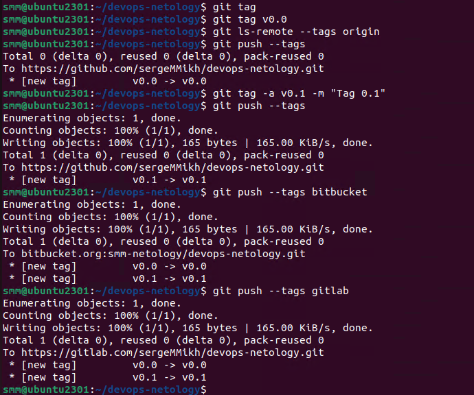 
  * github: 
    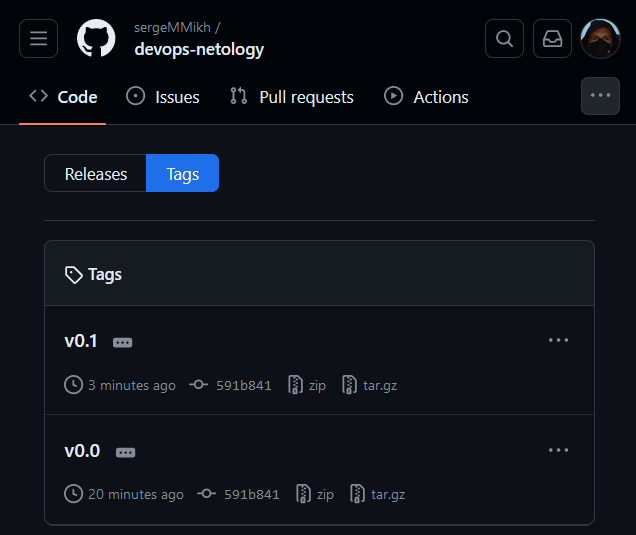 
  * gitlab: 
    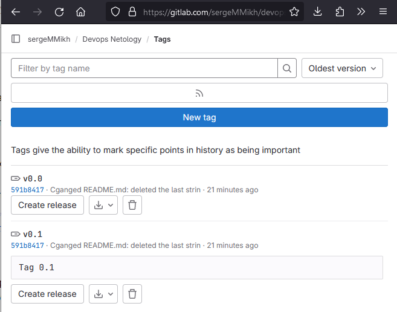 
  * bitbucket: 
    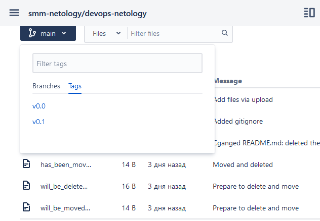 
  
  

## Задание 3. Ветки 

Давайте посмотрим, как будет выглядеть история коммитов при создании веток. 

1. Переключитесь обратно на ветку `main`, которая должна быть связана с веткой `main` репозитория на `github`.
1. Посмотрите лог коммитов и найдите хеш коммита с названием `Prepare to delete and move`, который был создан в пределах предыдущего домашнего задания. 
1. Выполните `git checkout` по хешу найденного коммита. 
1. Создайте новую ветку `fix`, базируясь на этом коммите `git switch -c fix`.
1. Отправьте новую ветку в репозиторий на GitHub `git push -u origin fix`. 
  **Решение** 
  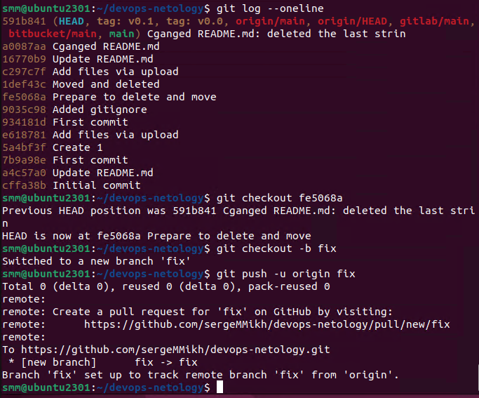
1. Посмотрите, как визуально выглядит ваша схема коммитов: 
  **Решение** 
  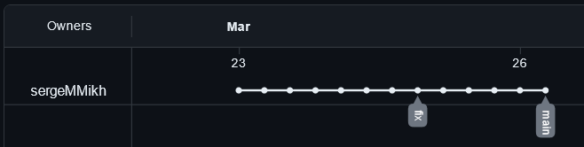
1. Теперь измените содержание файла `README.md`, добавив новую строчку.
1. Отправьте изменения в репозиторий и посмотрите, как изменится схема на странице и как изменится вывод команды `git log`. 
  **Решение** 
  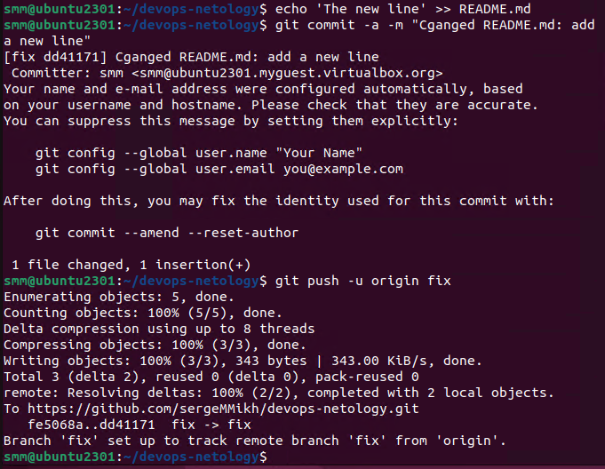 
  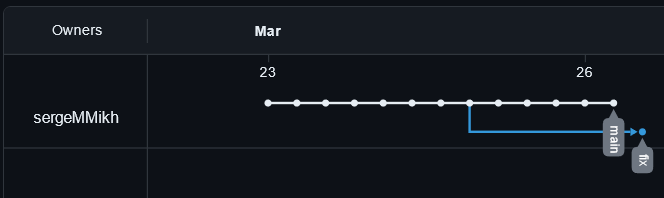 
  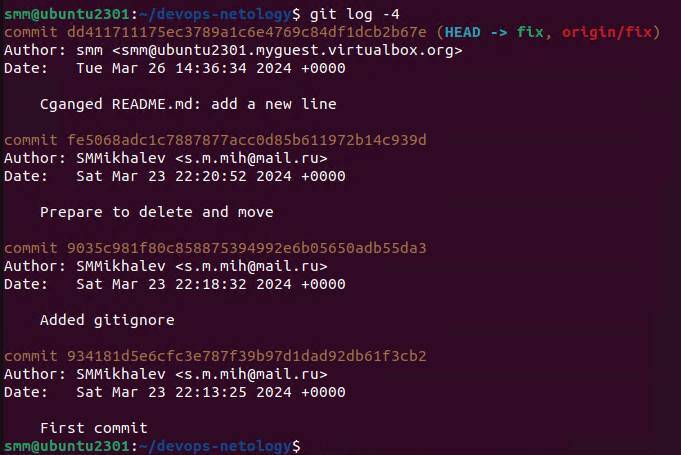

## Задание 4. Упрощаем себе жизнь

Попробуем поработь с Git при помощи визуального редактора. 

1. В используемой IDE PyCharm откройте визуальный редактор работы с Git, находящийся в меню View -> Tool Windows -> Git.
1. Измените какой-нибудь файл, и он сразу появится на вкладке `Local Changes`, отсюда можно выполнить коммит, нажав на кнопку внизу этого диалога.   
1. Попробуйте выполнить пару коммитов, используя IDE. 

**Решение**

  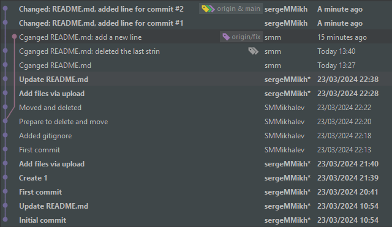

------

*В качестве результата работы по всем заданиям приложите ссылки на ваши репозитории в GitHub, GitLab и Bitbucket*.  

**Решение**
* [GitHub](https://github.com/sergeMMikh/devops-netology.git)
* [GitLab](https://gitlab.com/sergeMMikh/devops-netology)
* [Bitbucket](https://bitbucket.org/smm-netology/devops-netology/src/main/)
 
----
